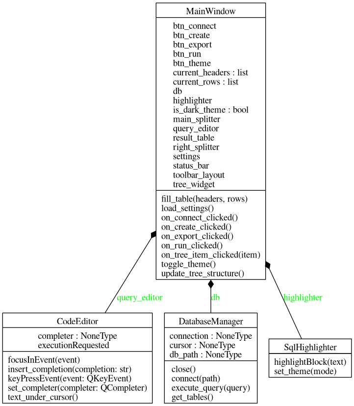
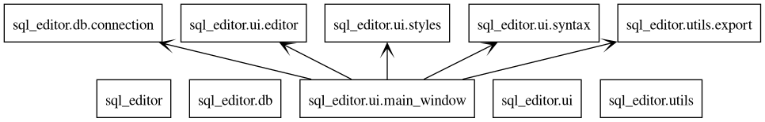

# SQL Editor

SQL Editor — это кроссплатформенное настольное приложение для управления базами данных SQLite, разработанное на языке Python с использованием графического фреймворка PyQt6.

Проект создан в рамках курсовой работы и представляет собой инструмент для создания, редактирования и визуализации данных, выполнения SQL-запросов и экспорта результатов выборки.

## Функциональные возможности

* **Управление базами данных**:
    * Создание новых файлов баз данных (`.db`, `.sqlite`).
    * Подключение к существующим локальным файлам БД.
    * Отображение структуры таблиц в иерархическом дереве.
* **Редактор SQL-кода**:
    * Синтаксическая подсветка (ключевые слова, строковые литералы, числа).
    * Интеллектуальное автодополнение ключевых слов (вызов через `Ctrl+Space`).
    * Поддержка горячих клавиш (`Enter` — выполнить, `Shift+Enter` — перенос строки).
* **Визуализация данных**:
    * Вывод результатов `SELECT` запросов в табличном виде.
    * Поддержка сортировки данных по столбцам.
    * Информационные сообщения о статусе выполнения операций (`INSERT`, `UPDATE`, `CREATE`).
* **Экспорт данных**:
    * Выгрузка результатов текущего запроса в формат CSV.
    * Выгрузка результатов текущего запроса в формат JSON.
* **Персонализация**:
    * Переключение между темной и светлой темами оформления интерфейса.
    * Настраиваемое рабочее пространство с помощью разделителей (`QSplitter`).

## Технологический стек

* **Язык программирования**: Python 3.10+
* **Графический интерфейс**: PyQt6
* **СУБД**: SQLite3 (встроенная библиотека `sqlite3`)
* **Тестирование**: pytest, pytest-qt

## Архитектура проекта

Проект построен по модульному принципу, разделяя логику взаимодействия с базой данных, пользовательский интерфейс и вспомогательные утилиты.

### Диаграмма классов (UML)



### Диаграмма пакетов



## Структура репозитория

```text
SQL-Editor/
├── main.py                 # Точка входа. Инициализация QApplication.
├── requirements.txt        # Список зависимостей проекта.
├── sql_editor/             # Основной пакет приложения.
│   ├── db/                 # Модуль взаимодействия с базой данных.
│   │   └── connection.py   # Класс DatabaseManager (CRUD операции).
│   ├── ui/                 # Модуль графического интерфейса.
│   │   ├── main_window.py  # Главное окно, компоновка виджетов, слоты.
│   │   ├── editor.py       # Кастомный виджет редактора кода.
│   │   ├── syntax.py       # Реализация подсветки синтаксиса (QSyntaxHighlighter).
│   │   └── styles.py       # Конфигурация QSS стилей (темы).
│   └── utils/              # Вспомогательные модули.
│       └── export.py       # Функции экспорта в CSV и JSON.
└── README.md
```

## Установка и запуск

1.  **Клонируйте репозиторий:**
    ```bash
    git clone [https://github.com/waitefy/SQL-Editor.git](https://github.com/waitefy/SQL-Editor.git)
    cd SQL-Editor
    ```

2.  **Создайте и активируйте виртуальное окружение (рекомендуется):**
    ```bash
    # Windows
    python -m venv .venv
    .venv\Scripts\activate

    # Linux/macOS
    python3 -m venv .venv
    source .venv/bin/activate
    ```

3.  **Установите зависимости:**
    ```bash
    pip install -r requirements.txt
    ```

4.  **Запустите приложение:**
    ```bash
    python main.py
    ```

## Лицензия
Данный проект распространяется на условиях лицензии **GNU General Public License v3.0 (GPLv3)**. Это обеспечивает свободу использования, модификации и распространения программного обеспечения при условии сохранения открытого исходного кода. Подробности см. в файле LICENSE.